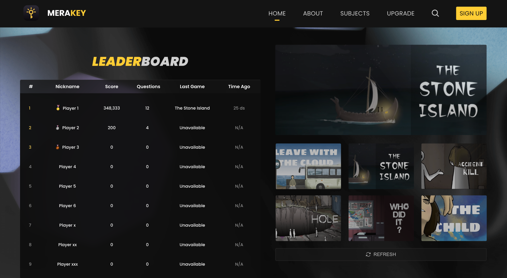
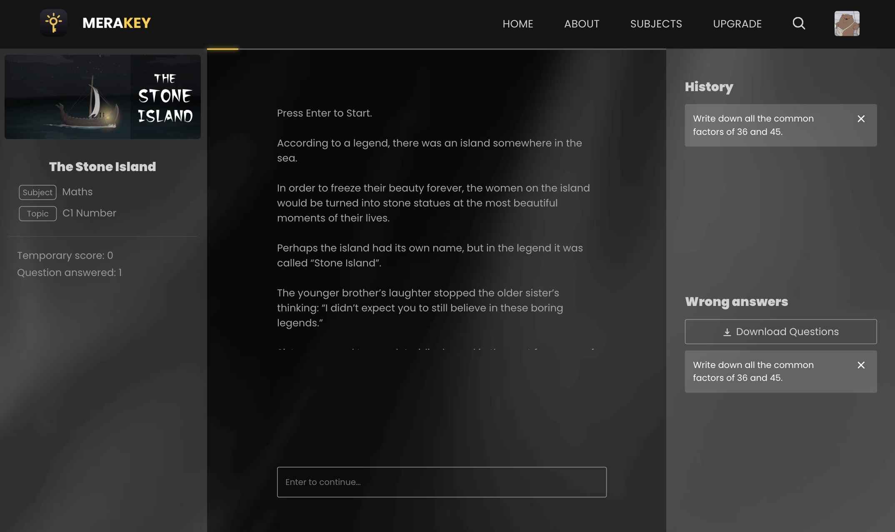
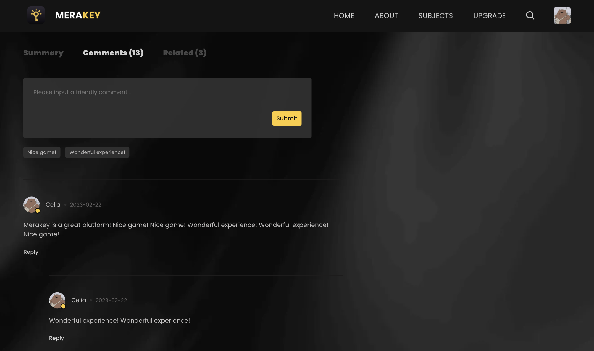
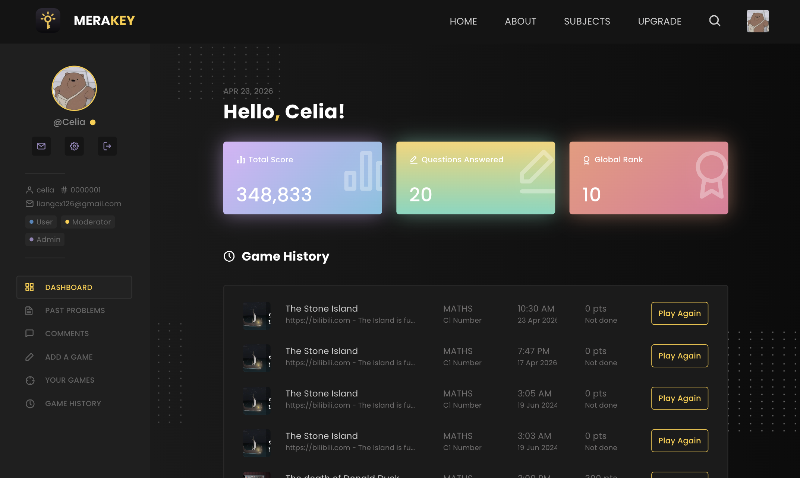
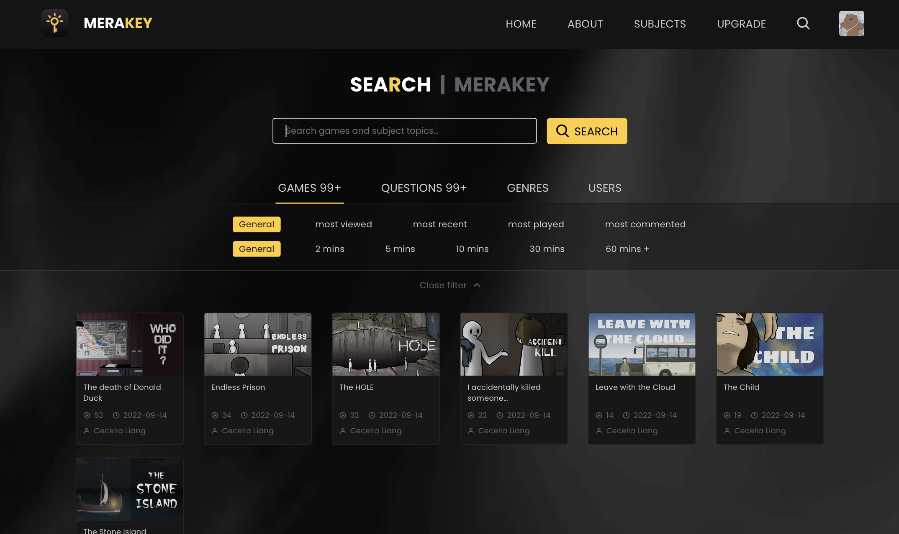

<p align="center">
  
</p>

<h1 align="center">Merakey</h1>

<p align="center">
  Interactive branching-story platform with a custom JSON-based narrative engine.
  <br />
  <sub>Originally built as an IB CS IA project.</sub>
</p>
<p align="center">
  <a href="https://liangchuxin.github.io/Merakey/">Live demo</a>
  ·
  <a href="https://github.com/liangchuxin/Merakey/blob/main/docs/Criterion%20C%20__%20Development.pdf">Original IA documentation</a>
</p>


---

## About

Merakey is a platform where users read, play, and comment on interactive educational stories — branching narratives that weave quiz questions into the plot. Readers make choices, answer questions, and end up in different storylines depending on their path. Authors build these stories by writing JSON-based "blocks" (story / question / option) that the engine traces at runtime.

The project was originally built in early 2023 as a year-long IB Computer Science Internal Assessment. The code here is preserved roughly as it was at the time of submission, with some cleanup of build artifacts and Azure deployment leftovers.

## Screenshots

<table>
  <tr>
    <td></td>
    <td></td>
  </tr>
  <tr>
    <td align="center"><sub>Play a story, track answers, see explanations</sub></td>
    <td align="center"><sub>Threaded comments with reply</sub></td>
  </tr>
  <tr>
    <td></td>
    <td></td>
  </tr>
  <tr>
    <td align="center"><sub>Personal dashboard with game history</sub></td>
    <td align="center"><sub>Search with filters and ordering</sub></td>
  </tr>
</table>

## Highlights

- **Custom narrative engine.** Stories are authored as JSON blocks (`story`, `question`, `option`) with pointer-based jumps — essentially a small DSL for interactive fiction. The frontend walks the block graph based on user input.
- **JWT auth with role-based access.** Bcrypt-hashed passwords, token stored client-side, route guards on the frontend, and a many-to-many `user_roles` table supporting User / Moderator / Admin.
- **Recursive comment threading.** Flat comment rows from the database are reshaped into a nested tree and rendered recursively, with inline reply composers.
- **Clean separation.** Frontend (`client/`) and backend (`api/`) are fully decoupled via REST. Swapping either side out would be straightforward.

## Stack

React · SCSS · Express · Sequelize · MySQL · JWT · Bcrypt

## Running locally

Requires Node.js and a local MySQL instance. You'll need to create a database and fill in connection details in `api/app/config/db.config.js` (and create a `.env` for the client if needed).

```bash
# backend
cd api
npm install
npm start

# frontend (in a separate terminal)
cd client
npm install
npm start
```

Frontend runs on `:8000`, backend on `:8080`.

## Notes

The backend was originally deployed on a self-managed Linux VM, which is no longer running. The live demo link above points to the static frontend (GitHub Pages) — it renders the UI but won't connect to a live API. The full experience requires running locally.

For a deep dive into the design decisions and implementation, see the [original IA documentation](docs/Criterion-C-Development.pdf).
